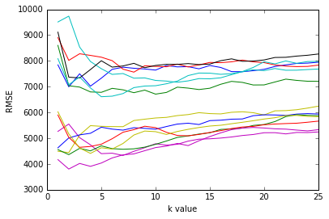
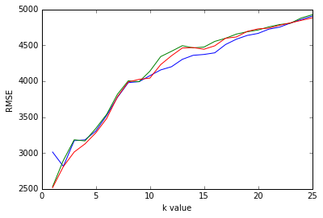

# Introduction to the dataset


```python
import pandas as pd
import numpy as np

pd.options.display.max_columns = 99

cols = ['symboling', 'normalized-losses', 'make', 'fuel-type', 'aspiration', 'num-of-doors', 'body-style', 
        'drive-wheels', 'engine-location', 'wheel-base', 'length', 'width', 'height', 'curb-weight', 'engine-type', 
        'num-of-cylinders', 'engine-size', 'fuel-system', 'bore', 'stroke', 'compression-rate', 'horsepower', 'peak-rpm', 'city-mpg', 'highway-mpg', 'price']
cars = pd.read_csv('imports-85.data', names=cols)
```


```python
cars = pd.read_csv('imports-85.data', names = cols)
cars.head()
```


<div>
<style scoped>
    .dataframe tbody tr th:only-of-type {
        vertical-align: middle;
    }

    .dataframe tbody tr th {
        vertical-align: top;
    }

    .dataframe thead th {
        text-align: right;
    }
</style>
<table border="1" class="dataframe">
  <thead>
    <tr style="text-align: right;">
      <th></th>
      <th>symboling</th>
      <th>normalized-losses</th>
      <th>make</th>
      <th>fuel-type</th>
      <th>aspiration</th>
      <th>num-of-doors</th>
      <th>body-style</th>
      <th>drive-wheels</th>
      <th>engine-location</th>
      <th>wheel-base</th>
      <th>length</th>
      <th>width</th>
      <th>height</th>
      <th>curb-weight</th>
      <th>engine-type</th>
      <th>num-of-cylinders</th>
      <th>engine-size</th>
      <th>fuel-system</th>
      <th>bore</th>
      <th>stroke</th>
      <th>compression-rate</th>
      <th>horsepower</th>
      <th>peak-rpm</th>
      <th>city-mpg</th>
      <th>highway-mpg</th>
      <th>price</th>
    </tr>
  </thead>
  <tbody>
    <tr>
      <th>0</th>
      <td>3</td>
      <td>?</td>
      <td>alfa-romero</td>
      <td>gas</td>
      <td>std</td>
      <td>two</td>
      <td>convertible</td>
      <td>rwd</td>
      <td>front</td>
      <td>88.6</td>
      <td>168.8</td>
      <td>64.1</td>
      <td>48.8</td>
      <td>2548</td>
      <td>dohc</td>
      <td>four</td>
      <td>130</td>
      <td>mpfi</td>
      <td>3.47</td>
      <td>2.68</td>
      <td>9.0</td>
      <td>111</td>
      <td>5000</td>
      <td>21</td>
      <td>27</td>
      <td>13495</td>
    </tr>
    <tr>
      <th>1</th>
      <td>3</td>
      <td>?</td>
      <td>alfa-romero</td>
      <td>gas</td>
      <td>std</td>
      <td>two</td>
      <td>convertible</td>
      <td>rwd</td>
      <td>front</td>
      <td>88.6</td>
      <td>168.8</td>
      <td>64.1</td>
      <td>48.8</td>
      <td>2548</td>
      <td>dohc</td>
      <td>four</td>
      <td>130</td>
      <td>mpfi</td>
      <td>3.47</td>
      <td>2.68</td>
      <td>9.0</td>
      <td>111</td>
      <td>5000</td>
      <td>21</td>
      <td>27</td>
      <td>16500</td>
    </tr>
    <tr>
      <th>2</th>
      <td>1</td>
      <td>?</td>
      <td>alfa-romero</td>
      <td>gas</td>
      <td>std</td>
      <td>two</td>
      <td>hatchback</td>
      <td>rwd</td>
      <td>front</td>
      <td>94.5</td>
      <td>171.2</td>
      <td>65.5</td>
      <td>52.4</td>
      <td>2823</td>
      <td>ohcv</td>
      <td>six</td>
      <td>152</td>
      <td>mpfi</td>
      <td>2.68</td>
      <td>3.47</td>
      <td>9.0</td>
      <td>154</td>
      <td>5000</td>
      <td>19</td>
      <td>26</td>
      <td>16500</td>
    </tr>
    <tr>
      <th>3</th>
      <td>2</td>
      <td>164</td>
      <td>audi</td>
      <td>gas</td>
      <td>std</td>
      <td>four</td>
      <td>sedan</td>
      <td>fwd</td>
      <td>front</td>
      <td>99.8</td>
      <td>176.6</td>
      <td>66.2</td>
      <td>54.3</td>
      <td>2337</td>
      <td>ohc</td>
      <td>four</td>
      <td>109</td>
      <td>mpfi</td>
      <td>3.19</td>
      <td>3.40</td>
      <td>10.0</td>
      <td>102</td>
      <td>5500</td>
      <td>24</td>
      <td>30</td>
      <td>13950</td>
    </tr>
    <tr>
      <th>4</th>
      <td>2</td>
      <td>164</td>
      <td>audi</td>
      <td>gas</td>
      <td>std</td>
      <td>four</td>
      <td>sedan</td>
      <td>4wd</td>
      <td>front</td>
      <td>99.4</td>
      <td>176.6</td>
      <td>66.4</td>
      <td>54.3</td>
      <td>2824</td>
      <td>ohc</td>
      <td>five</td>
      <td>136</td>
      <td>mpfi</td>
      <td>3.19</td>
      <td>3.40</td>
      <td>8.0</td>
      <td>115</td>
      <td>5500</td>
      <td>18</td>
      <td>22</td>
      <td>17450</td>
    </tr>
  </tbody>
</table>
</div>


# Determine numeric columns that can be used as features and which column is the target column


```python
# Select only the columns with continuous values from - https://archive.ics.uci.edu/ml/machine-learning-databases/autos/imports-85.names
continuous_values_cols = ['normalized-losses', 'wheel-base', 'length', 'width', 'height', 'curb-weight', 'bore', 'stroke', 'compression-rate', 'horsepower', 'peak-rpm', 'city-mpg', 'highway-mpg', 'price']
numeric_cars = cars[continuous_values_cols]
numeric_cars.head(5)
```


<div>
<style scoped>
    .dataframe tbody tr th:only-of-type {
        vertical-align: middle;
    }

    .dataframe tbody tr th {
        vertical-align: top;
    }

    .dataframe thead th {
        text-align: right;
    }
</style>
<table border="1" class="dataframe">
  <thead>
    <tr style="text-align: right;">
      <th></th>
      <th>normalized-losses</th>
      <th>wheel-base</th>
      <th>length</th>
      <th>width</th>
      <th>height</th>
      <th>curb-weight</th>
      <th>bore</th>
      <th>stroke</th>
      <th>compression-rate</th>
      <th>horsepower</th>
      <th>peak-rpm</th>
      <th>city-mpg</th>
      <th>highway-mpg</th>
      <th>price</th>
    </tr>
  </thead>
  <tbody>
    <tr>
      <th>0</th>
      <td>?</td>
      <td>88.6</td>
      <td>168.8</td>
      <td>64.1</td>
      <td>48.8</td>
      <td>2548</td>
      <td>3.47</td>
      <td>2.68</td>
      <td>9.0</td>
      <td>111</td>
      <td>5000</td>
      <td>21</td>
      <td>27</td>
      <td>13495</td>
    </tr>
    <tr>
      <th>1</th>
      <td>?</td>
      <td>88.6</td>
      <td>168.8</td>
      <td>64.1</td>
      <td>48.8</td>
      <td>2548</td>
      <td>3.47</td>
      <td>2.68</td>
      <td>9.0</td>
      <td>111</td>
      <td>5000</td>
      <td>21</td>
      <td>27</td>
      <td>16500</td>
    </tr>
    <tr>
      <th>2</th>
      <td>?</td>
      <td>94.5</td>
      <td>171.2</td>
      <td>65.5</td>
      <td>52.4</td>
      <td>2823</td>
      <td>2.68</td>
      <td>3.47</td>
      <td>9.0</td>
      <td>154</td>
      <td>5000</td>
      <td>19</td>
      <td>26</td>
      <td>16500</td>
    </tr>
    <tr>
      <th>3</th>
      <td>164</td>
      <td>99.8</td>
      <td>176.6</td>
      <td>66.2</td>
      <td>54.3</td>
      <td>2337</td>
      <td>3.19</td>
      <td>3.40</td>
      <td>10.0</td>
      <td>102</td>
      <td>5500</td>
      <td>24</td>
      <td>30</td>
      <td>13950</td>
    </tr>
    <tr>
      <th>4</th>
      <td>164</td>
      <td>99.4</td>
      <td>176.6</td>
      <td>66.4</td>
      <td>54.3</td>
      <td>2824</td>
      <td>3.19</td>
      <td>3.40</td>
      <td>8.0</td>
      <td>115</td>
      <td>5500</td>
      <td>18</td>
      <td>22</td>
      <td>17450</td>
    </tr>
  </tbody>
</table>
</div>


# Cleaning the data


```python
numeric_cars = numeric_cars.replace('?', np.nan)
numeric_cars.head(5)
```


<div>
<style scoped>
    .dataframe tbody tr th:only-of-type {
        vertical-align: middle;
    }

    .dataframe tbody tr th {
        vertical-align: top;
    }

    .dataframe thead th {
        text-align: right;
    }
</style>
<table border="1" class="dataframe">
  <thead>
    <tr style="text-align: right;">
      <th></th>
      <th>normalized-losses</th>
      <th>wheel-base</th>
      <th>length</th>
      <th>width</th>
      <th>height</th>
      <th>curb-weight</th>
      <th>bore</th>
      <th>stroke</th>
      <th>compression-rate</th>
      <th>horsepower</th>
      <th>peak-rpm</th>
      <th>city-mpg</th>
      <th>highway-mpg</th>
      <th>price</th>
    </tr>
  </thead>
  <tbody>
    <tr>
      <th>0</th>
      <td>NaN</td>
      <td>88.6</td>
      <td>168.8</td>
      <td>64.1</td>
      <td>48.8</td>
      <td>2548</td>
      <td>3.47</td>
      <td>2.68</td>
      <td>9.0</td>
      <td>111</td>
      <td>5000</td>
      <td>21</td>
      <td>27</td>
      <td>13495</td>
    </tr>
    <tr>
      <th>1</th>
      <td>NaN</td>
      <td>88.6</td>
      <td>168.8</td>
      <td>64.1</td>
      <td>48.8</td>
      <td>2548</td>
      <td>3.47</td>
      <td>2.68</td>
      <td>9.0</td>
      <td>111</td>
      <td>5000</td>
      <td>21</td>
      <td>27</td>
      <td>16500</td>
    </tr>
    <tr>
      <th>2</th>
      <td>NaN</td>
      <td>94.5</td>
      <td>171.2</td>
      <td>65.5</td>
      <td>52.4</td>
      <td>2823</td>
      <td>2.68</td>
      <td>3.47</td>
      <td>9.0</td>
      <td>154</td>
      <td>5000</td>
      <td>19</td>
      <td>26</td>
      <td>16500</td>
    </tr>
    <tr>
      <th>3</th>
      <td>164</td>
      <td>99.8</td>
      <td>176.6</td>
      <td>66.2</td>
      <td>54.3</td>
      <td>2337</td>
      <td>3.19</td>
      <td>3.40</td>
      <td>10.0</td>
      <td>102</td>
      <td>5500</td>
      <td>24</td>
      <td>30</td>
      <td>13950</td>
    </tr>
    <tr>
      <th>4</th>
      <td>164</td>
      <td>99.4</td>
      <td>176.6</td>
      <td>66.4</td>
      <td>54.3</td>
      <td>2824</td>
      <td>3.19</td>
      <td>3.40</td>
      <td>8.0</td>
      <td>115</td>
      <td>5500</td>
      <td>18</td>
      <td>22</td>
      <td>17450</td>
    </tr>
  </tbody>
</table>
</div>


```python
# Determine columns that need to be converted to numeric types and the number
# of rows that have a missing value in the normalized_losses column
numeric_cars = numeric_cars.astype('float')
numeric_cars.isnull().sum()
```


    normalized-losses    41
    wheel-base            0
    length                0
    width                 0
    height                0
    curb-weight           0
    bore                  4
    stroke                4
    compression-rate      0
    horsepower            2
    peak-rpm              2
    city-mpg              0
    highway-mpg           0
    price                 4
    dtype: int64


```python
# Because `price` is the column we want to predict, let's remove any rows with 
# missing `price` values.
numeric_cars = numeric_cars.dropna(subset=['price'])
numeric_cars.isnull().sum()
```


    normalized-losses    37
    wheel-base            0
    length                0
    width                 0
    height                0
    curb-weight           0
    bore                  4
    stroke                4
    compression-rate      0
    horsepower            2
    peak-rpm              2
    city-mpg              0
    highway-mpg           0
    price                 0
    dtype: int64


```python
# Replace missing values in other columns using column means.
numeric_cars = numeric_cars.fillna(numeric_cars.mean())
# Confirm that there's no more missing values!
numeric_cars.isnull().sum()
```


    normalized-losses    0
    wheel-base           0
    length               0
    width                0
    height               0
    curb-weight          0
    bore                 0
    stroke               0
    compression-rate     0
    horsepower           0
    peak-rpm             0
    city-mpg             0
    highway-mpg          0
    price                0
    dtype: int64


```python
# Normalize all columnns to range from 0 to 1 except the target column.
price_col = numeric_cars['price']
numeric_cars = (numeric_cars - numeric_cars.min())/(numeric_cars.max() - numeric_cars.min())
numeric_cars['price'] = price_col
```

# Univariate k-nearest neighbors models


```python
from sklearn.neighbors import KNeighborsRegressor
from sklearn.metrics import mean_squared_error

def knn_train_test(train_col, target_col, df):
    knn = KNeighborsRegressor()
    np.random.seed(1)
        
    # Randomize order of rows in data frame.
    shuffled_index = np.random.permutation(df.index)
    rand_df = df.reindex(shuffled_index)

    # Divide number of rows in half and round.
    last_train_row = int(len(rand_df) / 2)
    
    # Select the first half and set as training set.
    # Select the second half and set as test set.
    train_df = rand_df.iloc[0:last_train_row]
    test_df = rand_df.iloc[last_train_row:]
    
    # Fit a KNN model using default k value.
    knn.fit(train_df[[train_col]], train_df[target_col])
    
    # Make predictions using model.
    predicted_labels = knn.predict(test_df[[train_col]])

    # Calculate and return RMSE.
    mse = mean_squared_error(test_df[target_col], predicted_labels)
    rmse = np.sqrt(mse)
    return rmse

rmse_results = {}
train_cols = numeric_cars.columns.drop('price')

# For each column (minus `price`), train a model, return RMSE value
# and add to the dictionary `rmse_results`.
for col in train_cols:
    rmse_val = knn_train_test(col, 'price', numeric_cars)
    rmse_results[col] = rmse_val

# Create a Series object from the dictionary so 
# we can easily view the results, sort, etc
rmse_results_series = pd.Series(rmse_results)
rmse_results_series.sort_values()
```


    horsepower           4037.037713
    curb-weight          4401.118255
    highway-mpg          4630.026799
    width                4704.482590
    city-mpg             4766.422505
    length               5427.200961
    wheel-base           5461.553998
    compression-rate     6610.812153
    bore                 6780.627785
    normalized-losses    7330.197653
    peak-rpm             7697.459696
    stroke               8006.529545
    height               8144.441043
    dtype: float64


```python
def knn_train_test(train_col, target_col, df):
    np.random.seed(1)
        
    # Randomize order of rows in data frame.
    shuffled_index = np.random.permutation(df.index)
    rand_df = df.reindex(shuffled_index)

    # Divide number of rows in half and round.
    last_train_row = int(len(rand_df) / 2)
    
    # Select the first half and set as training set.
    # Select the second half and set as test set.
    train_df = rand_df.iloc[0:last_train_row]
    test_df = rand_df.iloc[last_train_row:]
    
    k_values = [1,3,5,7,9]
    k_rmses = {}
    
    for k in k_values:
        # Fit model using k nearest neighbors.
        knn = KNeighborsRegressor(n_neighbors=k)
        knn.fit(train_df[[train_col]], train_df[target_col])

        # Make predictions using model.
        predicted_labels = knn.predict(test_df[[train_col]])

        # Calculate and return RMSE.
        mse = mean_squared_error(test_df[target_col], predicted_labels)
        rmse = np.sqrt(mse)
        
        k_rmses[k] = rmse
    return k_rmses

k_rmse_results = {}

# For each column (minus `price`), train a model, return RMSE value
# and add to the dictionary `rmse_results`.
train_cols = numeric_cars.columns.drop('price')
for col in train_cols:
    rmse_val = knn_train_test(col, 'price', numeric_cars)
    k_rmse_results[col] = rmse_val

k_rmse_results
```


    {'bore': {1: 8602.58848450066,
      3: 6984.239489480916,
      5: 6780.627784685976,
      7: 6878.097965921532,
      9: 6866.808502038413},
     'city-mpg': {1: 5901.143574354764,
      3: 4646.746408727155,
      5: 4766.422505090134,
      7: 5232.523034167316,
      9: 5465.209492527533},
     'compression-rate': {1: 8087.205346523092,
      3: 7375.063685578359,
      5: 6610.812153159129,
      7: 6732.801282941515,
      9: 7024.485525463435},
     'curb-weight': {1: 5264.290230758878,
      3: 5022.318011757233,
      5: 4401.118254793124,
      7: 4330.608104418053,
      9: 4632.044474454401},
     'height': {1: 8904.04645636071,
      3: 8277.609643045525,
      5: 8144.441042663747,
      7: 7679.598124393773,
      9: 7811.03606291223},
     'highway-mpg': {1: 6025.594966720739,
      3: 4617.305019788554,
      5: 4630.026798588056,
      7: 4796.061440186946,
      9: 5278.358056953987},
     'horsepower': {1: 4170.054848037801,
      3: 4020.8492630885394,
      5: 4037.0377131537603,
      7: 4353.811860277134,
      9: 4515.135617419103},
     'length': {1: 4628.45550121557,
      3: 5129.8358210721635,
      5: 5427.2009608367125,
      7: 5313.427720847974,
      9: 5383.054514833446},
     'normalized-losses': {1: 7846.750605148984,
      3: 7500.5698123109905,
      5: 7330.197653434445,
      7: 7756.421586234123,
      9: 7688.096096891432},
     'peak-rpm': {1: 9511.480067750124,
      3: 8537.550899973421,
      5: 7697.4596964334805,
      7: 7510.294160083481,
      9: 7340.041341263401},
     'stroke': {1: 9116.495955406906,
      3: 7338.68466990294,
      5: 8006.529544647101,
      7: 7803.937796804327,
      9: 7735.554366079291},
     'wheel-base': {1: 4493.734068810494,
      3: 5120.161506064513,
      5: 5461.553997873057,
      7: 5448.1070513823315,
      9: 5738.405685192312},
     'width': {1: 4559.257297950061,
      3: 4606.413692169901,
      5: 4704.482589704386,
      7: 4571.485046194653,
      9: 4652.914172067787}}


# Vary the hyperparameter (k) value from 1 to 25


```python
def knn_train_test(train_col, target_col, df):
    np.random.seed(1)
        
    # Randomize order of rows in data frame.
    shuffled_index = np.random.permutation(df.index)
    rand_df = df.reindex(shuffled_index)

    # Divide number of rows in half and round.
    last_train_row = int(len(rand_df) / 2)
    
    # Select the first half and set as training set.
    # Select the second half and set as test set.
    train_df = rand_df.iloc[0:last_train_row]
    test_df = rand_df.iloc[last_train_row:]
    
    k_values = [x for x in range(1, 26)]
    k_rmses = {}
    
    for k in k_values:
        # Fit model using k nearest neighbors.
        knn = KNeighborsRegressor(n_neighbors=k)
        knn.fit(train_df[[train_col]], train_df[target_col])

        # Make predictions using model.
        predicted_labels = knn.predict(test_df[[train_col]])

        # Calculate and return RMSE.
        mse = mean_squared_error(test_df[target_col], predicted_labels)
        rmse = np.sqrt(mse)
        
        k_rmses[k] = rmse
    return k_rmses

k_rmse_results = {}

# For each column (minus `price`), train a model, return RMSE value
# and add to the dictionary `rmse_results`.
train_cols = numeric_cars.columns.drop('price')
for col in train_cols:
    rmse_val = knn_train_test(col, 'price', numeric_cars)
    k_rmse_results[col] = rmse_val

k_rmse_results
```


    {'bore': {1: 8602.58848450066,
      2: 7036.080558713983,
      3: 6984.239489480916,
      4: 6796.379776302794,
      5: 6780.627784685976,
      6: 6935.259318544373,
      7: 6878.097965921532,
      8: 6766.961150845205,
      9: 6866.808502038413,
      10: 6711.123635132913,
      11: 6776.498149688779,
      12: 6981.300997781925,
      13: 6944.67529215927,
      14: 6888.723990120597,
      15: 6940.390167538693,
      16: 7093.531966916317,
      17: 7205.980245131602,
      18: 7166.352055120553,
      19: 7066.242683621373,
      20: 7069.026753110227,
      21: 7182.004223250125,
      22: 7292.723082154618,
      23: 7244.557065246228,
      24: 7211.328223753566,
      25: 7207.693877327159},
     'city-mpg': {1: 5901.143574354764,
      2: 5031.938411362223,
      3: 4646.746408727155,
      4: 4680.486313667176,
      5: 4766.422505090134,
      6: 4979.5238112934785,
      7: 5232.523034167316,
      8: 5332.175643238558,
      9: 5465.209492527533,
      10: 5409.56476118417,
      11: 5229.877806448927,
      12: 5107.814001282709,
      13: 5092.996539126454,
      14: 5147.163014334258,
      15: 5223.891753503439,
      16: 5293.942828060179,
      17: 5375.523955356763,
      18: 5435.441866348425,
      19: 5458.534586268466,
      20: 5522.3575068637,
      21: 5551.071848740313,
      22: 5568.491605352222,
      23: 5582.03345328233,
      24: 5620.136267041714,
      25: 5663.163133260142},
     'compression-rate': {1: 8087.205346523092,
      2: 7076.9743288350355,
      3: 7375.063685578359,
      4: 6951.352201155179,
      5: 6610.812153159129,
      6: 6631.565127221375,
      7: 6732.801282941515,
      8: 6964.0659273672745,
      9: 7024.485525463435,
      10: 7037.301604012832,
      11: 7112.935404993325,
      12: 7215.069432360225,
      13: 7431.276603198712,
      14: 7529.101160688867,
      15: 7524.3704210095375,
      16: 7479.838284716387,
      17: 7505.364110874861,
      18: 7580.540009515794,
      19: 7659.143050952327,
      20: 7622.534534778188,
      21: 7704.789245032321,
      22: 7637.468411398348,
      23: 7640.75644610462,
      24: 7665.434561151332,
      25: 7683.952875176206},
     'curb-weight': {1: 5264.290230758878,
      2: 5550.55186512348,
      3: 5022.318011757233,
      4: 4742.881546210715,
      5: 4401.118254793124,
      6: 4418.368809715738,
      7: 4330.608104418053,
      8: 4491.429833104293,
      9: 4632.044474454401,
      10: 4786.143941578121,
      11: 4730.575419875025,
      12: 4763.797126288786,
      13: 4886.784974226148,
      14: 4963.201092140683,
      15: 4977.162710286299,
      16: 5005.5633088077475,
      17: 5047.838471355432,
      18: 5105.166652351578,
      19: 5143.984105609009,
      20: 5212.489650760199,
      21: 5215.0353808446525,
      22: 5167.331580850535,
      23: 5223.886659033085,
      24: 5219.086054280943,
      25: 5243.777745774623},
     'height': {1: 8904.04645636071,
      2: 8021.049661563462,
      3: 8277.609643045525,
      4: 8213.693382256411,
      5: 8144.441042663747,
      6: 8010.061904537408,
      7: 7679.598124393773,
      8: 7564.53954474289,
      9: 7811.03606291223,
      10: 7788.023297116904,
      11: 7773.544506771428,
      12: 7877.328239415181,
      13: 7765.399690288494,
      14: 7844.767573509128,
      15: 7941.523042972814,
      16: 7931.816239313108,
      17: 7964.63483313028,
      18: 8031.564338123957,
      19: 7964.799503390311,
      20: 7933.025228871136,
      21: 7844.07789646005,
      22: 7797.734259788923,
      23: 7779.281492873186,
      24: 7786.440259431323,
      25: 7836.427067824891},
     'highway-mpg': {1: 6025.594966720739,
      2: 5168.1783720807825,
      3: 4617.305019788554,
      4: 4411.165565826527,
      5: 4630.026798588056,
      6: 4578.28501688346,
      7: 4796.061440186946,
      8: 5123.749584404172,
      9: 5278.358056953987,
      10: 5254.100358230364,
      11: 5145.657885382418,
      12: 5260.633352580588,
      13: 5345.4066729326905,
      14: 5415.609658489603,
      15: 5472.279988257088,
      16: 5502.652753771503,
      17: 5561.857190724828,
      18: 5618.427045612897,
      19: 5678.757575398698,
      20: 5744.284867880973,
      21: 5796.125536534417,
      22: 5878.280538559638,
      23: 5885.143783143729,
      24: 5848.1423065524905,
      25: 5835.713214659751},
     'horsepower': {1: 4170.054848037801,
      2: 3803.2395476660017,
      3: 4020.8492630885394,
      4: 3907.843870390235,
      5: 4037.0377131537603,
      6: 4234.914425772894,
      7: 4353.811860277134,
      8: 4391.779417789255,
      9: 4515.135617419103,
      10: 4637.019239823688,
      11: 4693.75949782112,
      12: 4797.316799901442,
      13: 4713.617172875044,
      14: 4901.305132649263,
      15: 5064.793818858449,
      16: 5208.3098859678485,
      17: 5332.27365585093,
      18: 5392.383316413357,
      19: 5418.012519514055,
      20: 5396.057291937447,
      21: 5365.0035183066275,
      22: 5352.645312247042,
      23: 5315.755635002835,
      24: 5284.257054477735,
      25: 5330.7573074358015},
     'length': {1: 4628.45550121557,
      2: 5009.409196948803,
      3: 5129.8358210721635,
      4: 5191.789946422358,
      5: 5427.2009608367125,
      6: 5353.367715222768,
      7: 5313.427720847974,
      8: 5408.074004139666,
      9: 5383.054514833446,
      10: 5349.926225650312,
      11: 5453.122025678248,
      12: 5548.629120173971,
      13: 5582.7079909131035,
      14: 5531.323122732788,
      15: 5682.605157416227,
      16: 5698.9543504798885,
      17: 5738.260136706878,
      18: 5747.17427183713,
      19: 5873.879785712904,
      20: 5908.847102985523,
      21: 5902.640337401367,
      22: 5883.838241476871,
      23: 5936.1225097899005,
      24: 5954.827756840488,
      25: 5938.432222977629},
     'normalized-losses': {1: 7846.750605148984,
      2: 6995.131629735551,
      3: 7500.5698123109905,
      4: 7021.331493118835,
      5: 7330.197653434445,
      6: 7673.178939792764,
      7: 7756.421586234123,
      8: 7714.914085041584,
      9: 7688.096096891432,
      10: 7643.35110370801,
      11: 7820.285424210016,
      12: 7768.269381617024,
      13: 7777.293219853689,
      14: 7693.317849881212,
      15: 7820.873511771476,
      16: 7746.348424250326,
      17: 7585.130759747524,
      18: 7579.949595426682,
      19: 7620.754324394608,
      20: 7674.413891343336,
      21: 7784.4898883242795,
      22: 7845.747790594962,
      23: 7902.054387503109,
      24: 7914.0886640021035,
      25: 7949.008319880456},
     'peak-rpm': {1: 9511.480067750124,
      2: 9737.491857544353,
      3: 8537.550899973421,
      4: 7976.75888635631,
      5: 7697.4596964334805,
      6: 7477.286039573567,
      7: 7510.294160083481,
      8: 7329.572355200376,
      9: 7340.041341263401,
      10: 7242.7783284831075,
      11: 7217.748058014115,
      12: 7171.089076563224,
      13: 7225.356586083696,
      14: 7314.068460452133,
      15: 7304.813120974775,
      16: 7344.7704415765775,
      17: 7466.366973242685,
      18: 7586.582300264459,
      19: 7746.679932578338,
      20: 7966.7899437708475,
      21: 7885.268630449549,
      22: 7999.024680014346,
      23: 7906.93802529281,
      24: 7975.064743788108,
      25: 7982.547066895378},
     'stroke': {1: 9116.495955406906,
      2: 7369.025510557521,
      3: 7338.68466990294,
      4: 7665.714154032658,
      5: 8006.529544647101,
      6: 7759.328503986881,
      7: 7803.937796804327,
      8: 7906.197116981594,
      9: 7735.554366079291,
      10: 7824.006408427138,
      11: 7867.034871179118,
      12: 7865.78968857657,
      13: 7896.748362112975,
      14: 7856.886076381393,
      15: 7877.4216949149,
      16: 8008.590461333814,
      17: 8080.232934513359,
      18: 7984.864527049937,
      19: 7994.988643539706,
      20: 8037.645577872606,
      21: 8133.461128835945,
      22: 8140.093737721607,
      23: 8186.890069158859,
      24: 8219.457447274173,
      25: 8268.359263546861},
     'wheel-base': {1: 4493.734068810494,
      2: 4442.179882547632,
      3: 5120.161506064513,
      4: 5487.831706127406,
      5: 5461.553997873057,
      6: 5450.864836232071,
      7: 5448.1070513823315,
      8: 5686.650799240269,
      9: 5738.405685192312,
      10: 5785.108559718025,
      11: 5808.9885357403355,
      12: 5877.797078136432,
      13: 5917.1337683917845,
      14: 5991.512998303531,
      15: 5955.459668745193,
      16: 5943.037696104363,
      17: 6006.286312669348,
      18: 6026.543165533284,
      19: 5989.971723368719,
      20: 5902.2391217232125,
      21: 6062.577055533055,
      22: 6071.322109519163,
      23: 6105.8897457002695,
      24: 6169.0487190792965,
      25: 6243.9455500254935},
     'width': {1: 4559.257297950061,
      2: 4362.596086774093,
      3: 4606.413692169901,
      4: 4509.391428872318,
      5: 4704.482589704386,
      6: 4594.594316165793,
      7: 4571.485046194653,
      8: 4588.059575750665,
      9: 4652.914172067787,
      10: 4762.6203887073225,
      11: 4891.354659619978,
      12: 5030.922801528785,
      13: 5090.367000378958,
      14: 5161.404358648473,
      15: 5211.335993435815,
      16: 5341.554777093258,
      17: 5359.539380615307,
      18: 5394.139348439547,
      19: 5496.525623150344,
      20: 5531.624950010101,
      21: 5646.088024982938,
      22: 5839.106891461296,
      23: 5913.008090599902,
      24: 5887.970834362867,
      25: 5873.273457502044}}


# Optimal k-values


```python
import matplotlib.pyplot as plt
%matplotlib inline

for k,v in k_rmse_results.items():
    x = list(v.keys())
    y = list(v.values())
    
    plt.plot(x,y)
    plt.xlabel('k value')
    plt.ylabel('RMSE')
```





# Multivariate Model


```python
# Compute average RMSE across different `k` values for each feature.
feature_avg_rmse = {}
for k,v in k_rmse_results.items():
    avg_rmse = np.mean(list(v.values()))
    feature_avg_rmse[k] = avg_rmse
series_avg_rmse = pd.Series(feature_avg_rmse)
series_avg_rmse.sort_values()
```


    horsepower           4785.517349
    curb-weight          4941.817440
    width                5103.201231
    city-mpg             5292.726965
    highway-mpg          5354.871902
    length               5543.036230
    wheel-base           5727.454054
    bore                 7065.167818
    compression-rate     7339.368069
    normalized-losses    7666.078738
    peak-rpm             7778.152867
    height               7939.458532
    stroke               7957.757540
    dtype: float64


```python
# Best features
def knn_train_test(train_cols, target_col, df):
    np.random.seed(1)
    
    # Randomize order of rows in data frame.
    shuffled_index = np.random.permutation(df.index)
    rand_df = df.reindex(shuffled_index)

    # Divide number of rows in half and round.
    last_train_row = int(len(rand_df) / 2)
    
    # Select the first half and set as training set.
    # Select the second half and set as test set.
    train_df = rand_df.iloc[0:last_train_row]
    test_df = rand_df.iloc[last_train_row:]
    
    k_values = [5]
    k_rmses = {}
    
    for k in k_values:
        # Fit model using k nearest neighbors.
        knn = KNeighborsRegressor(n_neighbors=k)
        knn.fit(train_df[train_cols], train_df[target_col])

        # Make predictions using model.
        predicted_labels = knn.predict(test_df[train_cols])

        # Calculate and return RMSE.
        mse = mean_squared_error(test_df[target_col], predicted_labels)
        rmse = np.sqrt(mse)
        
        k_rmses[k] = rmse
    return k_rmses

k_rmse_results = {}

two_best_features = ['horsepower', 'width']
rmse_val = knn_train_test(two_best_features, 'price', numeric_cars)
k_rmse_results["two best features"] = rmse_val

three_best_features = ['horsepower', 'width', 'curb-weight']
rmse_val = knn_train_test(three_best_features, 'price', numeric_cars)
k_rmse_results["three best features"] = rmse_val

four_best_features = ['horsepower', 'width', 'curb-weight', 'city-mpg']
rmse_val = knn_train_test(four_best_features, 'price', numeric_cars)
k_rmse_results["four best features"] = rmse_val

five_best_features = ['horsepower', 'width', 'curb-weight' , 'city-mpg' , 'highway-mpg']
rmse_val = knn_train_test(five_best_features, 'price', numeric_cars)
k_rmse_results["five best features"] = rmse_val

six_best_features = ['horsepower', 'width', 'curb-weight' , 'city-mpg' , 'highway-mpg', 'length']
rmse_val = knn_train_test(six_best_features, 'price', numeric_cars)
k_rmse_results["six best features"] = rmse_val

k_rmse_results
```


    {'five best features': {5: 3341.6024539726504},
     'four best features': {5: 3280.3807311630976},
     'six best features': {5: 3628.261188214127},
     'three best features': {5: 3305.9401397969677},
     'two best features': {5: 3589.3132622073304}}


```python
def knn_train_test(train_cols, target_col, df):
    np.random.seed(1)
    
    # Randomize order of rows in data frame.
    shuffled_index = np.random.permutation(df.index)
    rand_df = df.reindex(shuffled_index)

    # Divide number of rows in half and round.
    last_train_row = int(len(rand_df) / 2)
    
    # Select the first half and set as training set.
    # Select the second half and set as test set.
    train_df = rand_df.iloc[0:last_train_row]
    test_df = rand_df.iloc[last_train_row:]
    
    k_values = [i for i in range(1, 26)]
    k_rmses = {}
    
    for k in k_values:
        # Fit model using k nearest neighbors.
        knn = KNeighborsRegressor(n_neighbors=k)
        knn.fit(train_df[train_cols], train_df[target_col])

        # Make predictions using model.
        predicted_labels = knn.predict(test_df[train_cols])

        # Calculate and return RMSE.
        mse = mean_squared_error(test_df[target_col], predicted_labels)
        rmse = np.sqrt(mse)
        
        k_rmses[k] = rmse
    return k_rmses

k_rmse_results = {}

three_best_features = ['horsepower', 'width', 'curb-weight']
rmse_val = knn_train_test(three_best_features, 'price', numeric_cars)
k_rmse_results["three best features"] = rmse_val

four_best_features = ['horsepower', 'width', 'curb-weight', 'city-mpg']
rmse_val = knn_train_test(four_best_features, 'price', numeric_cars)
k_rmse_results["four best features"] = rmse_val

five_best_features = ['horsepower', 'width', 'curb-weight' , 'city-mpg' , 'highway-mpg']
rmse_val = knn_train_test(five_best_features, 'price', numeric_cars)
k_rmse_results["five best features"] = rmse_val

k_rmse_results
```


    {'five best features': {1: 2530.0554077602005,
      2: 2897.1757974767684,
      3: 3183.4597426217424,
      4: 3168.0230415758415,
      5: 3341.6024539726504,
      6: 3537.520542998191,
      7: 3817.290452118825,
      8: 4004.414529685573,
      9: 3992.3186041830318,
      10: 4138.728787853335,
      11: 4342.052852829098,
      12: 4416.145381031136,
      13: 4493.8798141857205,
      14: 4463.501601554571,
      15: 4474.480783207805,
      16: 4553.5595362768345,
      17: 4597.001081375769,
      18: 4655.283442648355,
      19: 4687.900893982822,
      20: 4712.022985543165,
      21: 4755.856625823773,
      22: 4788.162720030673,
      23: 4806.923381965054,
      24: 4879.983352195467,
      25: 4923.844843032469},
     'four best features': {1: 2516.589279950226,
      2: 2811.1727257604443,
      3: 3013.3615157930335,
      4: 3126.269482641261,
      5: 3280.3807311630976,
      6: 3479.5099401018138,
      7: 3781.5612742414464,
      8: 3988.8669577450623,
      9: 4024.998621362245,
      10: 4042.247226187899,
      11: 4230.335248684068,
      12: 4354.008675154061,
      13: 4461.626664877788,
      14: 4468.029845088927,
      15: 4444.164407677133,
      16: 4492.069868571789,
      17: 4597.262222692034,
      18: 4615.446316768325,
      19: 4692.5688728042505,
      20: 4727.815985112382,
      21: 4738.233067652869,
      22: 4778.176687231466,
      23: 4811.556798910073,
      24: 4846.548529789929,
      25: 4881.218665692508},
     'three best features': {1: 3013.0109985241875,
      2: 2813.285969825997,
      3: 3171.585284478674,
      4: 3182.3137417981943,
      5: 3305.9401397969677,
      6: 3522.506848900376,
      7: 3774.3772094554106,
      8: 3978.969124021116,
      9: 3992.923680588881,
      10: 4076.2381473803043,
      11: 4156.388331131807,
      12: 4201.10713385948,
      13: 4303.62676861325,
      14: 4359.693296989702,
      15: 4371.771103372868,
      16: 4394.4846551644205,
      17: 4510.399710057406,
      18: 4584.310961865486,
      19: 4636.62620477063,
      20: 4664.465847866811,
      21: 4724.096637428273,
      22: 4752.535484102914,
      23: 4808.703310452101,
      24: 4858.9452710176065,
      25: 4904.576331966618}}


```python
for k,v in k_rmse_results.items():
    x = list(v.keys())
    y = list(v.values())
    
    plt.plot(x,y)
    plt.xlabel('k value')
    plt.ylabel('RMSE')
```





```python

```
